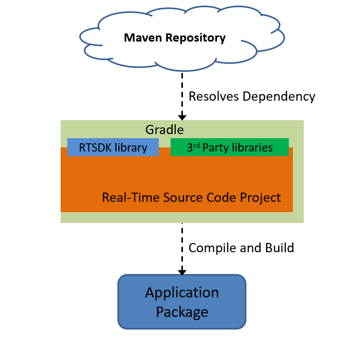
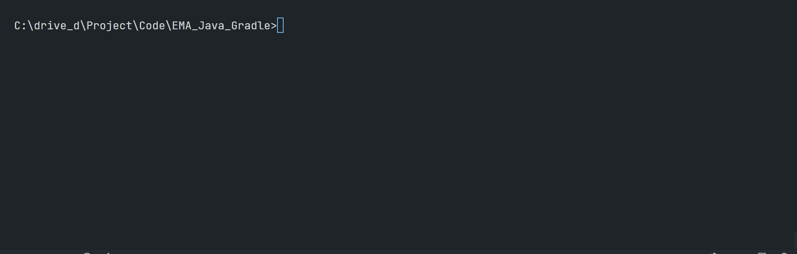

# How to Set Up Enterprise Message API Java Application with Gradle: Development Detail

## <a id="what_gradle"></a>What is Gradle?

[Gradle](https://gradle.org/) is a multi-language open-source build automation tool. It helps developers and the team to organize the project structure, manage dependencies, and process development tasks such as running the application, packaging/publishing, testing, and much more. The tool is designed for multi-project builds, aims for high performance, supports multiple platforms (runs on the JVM), supports custom tasks and plugins, and fully IDE supported.

Gradle is the official build tool for the Android development platform. 



## <a id="gradle_layout"></a>Project Structure  

Moving on to Gradle project structure. Gradle is designed for multi-projects development. A recommended structure consists of one root project, and one or more subprojects (the [RTSDK Java](https://github.com/Refinitiv/Real-Time-SDK/tree/master/Java) uses the same structure too). This project folder diagram is as follow:

```
.
├── LICENSE.md
├── README.md
├── ema_app
│   ├── EmaConfig.xml
│   ├── build.gradle
│   ├── etc
│   │   └── ...
│   └── src
│       ├── main
│       │   ├── java
│       │   │   └── com
│       │   │       └── refinitiv
│       │   │           └── ema
│       │   │               └── examples
│       │   │                   ├── cloudconsumer
│       │   │                   │   └── Consumer.java
│       │   │                   └── localconsumer
│       │   │                       └── Consumer.java
│       │   └── resources
│       │       └── logback.xml
│       └── test
│              └── resources
│                 └── ...
├── gradle
│   └── wrapper
│       ├── gradle-wrapper.jar
│       └── gradle-wrapper.properties
├── gradlew
├── gradlew.bat
└── settings.gradle
```

- *&lt;root&gt;/settings.gradle*: Defined the subprojects to include. 
- *&lt;root&gt;/&lt;subproject&gt;/build.gradle*: Subproject configuration
- *&lt;root&gt;/&lt;subproject&gt;/src/main/java*: Application/Library sources
- *&lt;root&gt;/&lt;subproject&gt;/src/main/resources*: Application/Library resources
- *&lt;root&gt;/&lt;subproject&gt;/src/test/java*:  Test sources
- *&lt;root&gt;/&lt;subproject&gt;/src/test/resources*: Test resources
- *&lt;root&gt;/&lt;subproject&gt;/gradle/*:    Gradle Wrapper (generated from Gradle build)
- *&lt;root&gt;/&lt;subproject&gt;/gradlew*:    Gradle Wrapper start script (generated from Gradle build)
- *&lt;root&gt;/&lt;subproject&gt;/gradlew.bat*:    Gradle Wrapper start script (generated from Gradle build)
- *&lt;root&gt;/LICENSE.txt*:   Project's license
- *&lt;root&gt;/README.txt*:    Project's readme

If you are familiar with Maven, the Gradle project layout is mostly identical to [Maven project](https://maven.apache.org/guides/introduction/introduction-to-the-standard-directory-layout.html).

For more detail on Gradle project layout, please check the following resources:
- [Structuring and Building a Software Component with Gradle](https://docs.gradle.org/7.3.3/userguide/multi_project_builds.html)
- [Organizing Gradle Projects](https://docs.gradle.org/7.3.3/userguide/organizing_gradle_projects.html)

With Gradle, the project always has a blueprint for the folder structure.

## <a id="gradle_setting"></a>The settings.gradle file

My next point is the root project setting. The root project does not have a Gradle build file, it contains only a ```settings.gradle``` file that defines the subprojects to include per Gradle build. The file is generated by the Gradle 'init' task automatically.

This file is actually a [Groovy](https://groovy-lang.org/) Domain-Specific Language (DSL) in the following format:

```
rootProject.name = '<Project name>'
include('sub_project_1')
include('sub_project_2')
```

I am using the following setting for this project:

```
rootProject.name = 'ema_app'
include('ema_app')
```

Note: If the project uses [Kotlin](https://kotlinlang.org/) DSL, this file is ```settings.gradle.kts```

That’s all I have to say about the settings.gradle file.

## <a id="gradle_ema"></a>Gradle build file setting for EMA Java

That brings us to the subproject configuration. Each subproject contains the ```build.gradle``` or ```build.gradle.kts``` file. It is the project's configuration. The file uses [Groovy](https://groovy-lang.org/) (default option) and [Kotlin](https://kotlinlang.org/) DSL format. 
* Note: Starting from Gradle version 8.2, Gradle will use [Kotlin as a defautl language](https://blog.gradle.org/kotlin-dsl-is-now-the-default-for-new-gradle-builds) when developers create new projects.

The file contains all project configurations such as project type, Application main class, Java compilation options, etc. The equivalent file in Maven is the ```pom.xml``` file. 

Example:

``` groovy
plugins {
    id 'java'
    id 'application'
   
}

compileJava {
    options.release = 11
}

version = '1.0'

application {
    // Define the main class for the application
    mainClassName = 'com.refinitiv.ema.examples.localconsumer.Consumer'
}

```

The brief information of each ```build.gradle``` configuration function are as follows:
- ```plugins```: Set the project type to Gradle for applying specific features (like compiling Java Code). This is a Java project that creates an executable JVM application, so I am setting *java* and *application* plugins
- ```compileJava```: Set the compiler option. I am setting ```options.release = 11``` for targetting the compiled class(s) to compatible with Java 11
- ```version```: Set the project version 
- ```application```: Set the *application* plugin properties. I am setting the project main class as *com.refinitiv.ema.examples.localconsumer.Consumer* which is based on the EMA Java Consumer 100 example.

You can specify the following EMA Java application dependencies in Gradle build.gradle file. The EMA Java is the message-level API built on top of the ETA Java (Transport API), Gradle can automatically pull all dependency artifacts within Maven central for the application.

``` groovy
plugins {
    id 'java'
    id 'application'  
}
...
repositories {
    mavenCentral()
}

dependencies {
    // This dependency is used by the application.
    implementation 'com.refinitiv.ema:ema:3.7.0.0'
}
```

The ```repositories``` function specifies where to look for the module that we declare as dependencies.  The ```dependencies``` specifies the libraries' IDs and the ```implementation``` property means the project uses EMA for both compilation and runtime.

Please see more detail on the following pages:
- [Build Java and JVM projects](https://docs.gradle.org/7.3.3/userguide/building_java_projects.html)
- [Dependency Management Terminology](https://docs.gradle.org/7.3.3/userguide/dependency_management_terminology.html#dependency_management_terminology)

## <a id="gradle_running"></a>Build and Run the Main Application with Gradle

You can run the *build* task to compile all projects via the following command:

``` Bash
gradlew build
```

The class files will be available in the subproject's *build* folder by default.

Note: Gradle encourages developers to interact with Gradle via the [Gradle Wrapper](https://docs.gradle.org/current/userguide/gradle_wrapper.html#gradle_wrapper).

Unlike Maven, developers can build and run the main application (the class that has been set via the ```application.mainClassName``` function above) with Gradlde *run* task directly without interacting with class or jar files.

``` Bash
gradlew run
```
Example:

``` Bash
$>gradlew run

> Task :ema_app:run
17:26:49.611 [main] INFO com.refinitiv.ema.access.OmmConsumerImpl -- loggerMsg
    ClientName: ChannelCallbackClient
    Severity: Info
    Text:    Received ChannelUp event on channel Channel_1
        Instance Name Consumer_1_1
        Component Version ads3.6.3.L1.linux.rrg 64-bit
loggerMsgEnd


RefreshMsg
    streamId="5"
    domain="MarketPrice Domain"
    solicited
    RefreshComplete
    state="Open / Ok / None / ''"
    itemGroup="00 01"
    permissionData="03 01 01 36 3c"
    name="/THB="
    nameType="1"
    serviceId="10001"
    serviceName="ELEKTRON_DD"
    Payload dataType="FieldList"
        FieldList FieldListNum="99" DictionaryId="1"
            FieldEntry fid="1" name="PROD_PERM" dataType="UInt" value="363"
            FieldEntry fid="2" name="RDNDISPLAY" dataType="UInt" value="153"
            FieldEntry fid="3" name="DSPLY_NAME" dataType="Rmtes" value="CIMB THAI BK B/d"
            FieldEntry fid="5" name="TIMACT" dataType="Time" value="09:56:00:000:000:000"
            FieldEntry fid="11" name="NETCHNG_1" dataType="Real" value="0.23"
            FieldEntry fid="12" name="HIGH_1" dataType="Real" value="34.46"
            FieldEntry fid="13" name="LOW_1" dataType="Real" value="34.17"
            ....
```



### How to parse parameters to the application. 

My current main class is ```com.refinitiv.ema.examples.localconsumer.Consumer``` which is based on the EMA Java Consumer ex100_MP_Streaming example. The application connects and consumes real-time streaming data with the service *ELEKTRON_DD* from the RTDS or Interactive Provider application in the same machine (*localhost*) by default. However, I have modified it to receive the server IP Address/Hostname, RSSL Port, Service Name, Item Name, and DACS username via command-line arguments. So, how can developers parse parameters to the application via the ```gradlew run``` command? 

You can pass parameters to the run task with ```--args=``` option as follows:

``` Bash 
gradlew run --args="-service IDN_RDF -itemName AAPL.O"
```
To clean up the build, you can just run a ```gradlew clean``` command to can delete the contents of the build directory.

Please find more detail about Gradle command-line interface from [Gradle page](https://docs.gradle.org/7.3.3/userguide/command_line_interface.html#sec:command_line_completion).

## <a id="gradle_running"></a>Build and Run Other Java Tasks

Running the main application with the ```gradlew run``` command is convenient. However, developers may need to run multiple applications to start or test other services at the same time. It is not practical to keep changing the main class in ```application.mainClassName``` function of a ```build.gradle``` file. So, how can we run multiple applications with less modification?

Fortunately, Gradle lets developers create [tasks](https://docs.gradle.org/7.3.3/dsl/org.gradle.api.Task.html) for various propose, including running others Java classes. The best example is the official RTSDK Java ```build.gradle``` that supports various SDK samples via Gradle task such as  ```gradlew runconsumer100```, ```gradlew runiprovider180```, ```gradlew runVAConsumer```, etc.   

While RTSDK Java's build.gradle uses a complex script to support multiple tasks dynamically, this project uses a simple custom task for running Java applications as follows

``` Groovy
task runCloudConsumer(type: JavaExec) {

    dependsOn('compileJava')
    classpath = sourceSets.main.runtimeClasspath
    
    mainClass = 'com.refinitiv.ema.examples.cloudconsumer.Consumer'
}
```
The ```runCloudConsumer``` task is defined as [type JavaExec](https://docs.gradle.org/7.3.3/dsl/org.gradle.api.tasks.JavaExec.html) for executing a Java application in a child process. Develops can set the classpath, application class, and task properties in the task function.
- *classpath*: The classpath for executing the main class.
- *mainClass*: The fully qualified name of the Main class to be executed. I am using the ```com.refinitiv.ema.examples.cloudconsumer.Consumer``` which is based on EMA Java Consumer ex113_MP_SessionMgmt example.
- *dependsOn('compileJava')*: Method is for setting this task to compile the project before running the class.

You can run the Gradle task with the ```gradlew [taskName...] [--option-name...]``` command. Please noted that it supports the ```--args=``` option too.

Example:

```Bash
$>gradlew runCloudConsumer --args="-clientId $RTO_CLIENTID_V2 -clientSecret $RTO_CLIENTSECRET% -itemName /THB="

> Task :ema_app:runCloudConsumer
16:22:56.111 [main] INFO com.refinitiv.ema.access.OmmConsumerImpl -- loggerMsg
    ClientName: ChannelCallbackClient
    Severity: Info
    Text:    Received ChannelUp event on channel Channel_4
        Instance Name Consumer_4_1
        Component Version ads3.5.4.E1.linux.rrg 64-bit
loggerMsgEnd


RefreshMsg
    streamId="5"
    domain="MarketPrice Domain"
    solicited
    RefreshComplete
    state="Open / Ok / None / ''"
    itemGroup="00 08"
    permissionData="03 01 01 36 3c"
    name="/THB="
    nameType="1"
    serviceId="257"
    serviceName="ELEKTRON_DD"
    Payload dataType="FieldList"
        FieldList FieldListNum="99" DictionaryId="1"
            FieldEntry fid="1" name="PROD_PERM" dataType="UInt" value="363"
            FieldEntry fid="2" name="RDNDISPLAY" dataType="UInt" value="153"
            FieldEntry fid="3" name="DSPLY_NAME" dataType="Rmtes" value="STONEX GROUP G/d"
            FieldEntry fid="5" name="TIMACT" dataType="Time" value="08:51:00:000:000:000"
            FieldEntry fid="11" name="NETCHNG_1" dataType="Real" value="0.00"
            FieldEntry fid="12" name="HIGH_1" dataType="Real" value="34.15"
            FieldEntry fid="13" name="LOW_1" dataType="Real" value="34.05"
            FieldEntry fid="15" name="CURRENCY" dataType="Enum" value="764"
            FieldEntry fid="17" name="ACTIV_DATE" dataType="Date" value="07 APR 2023"
            FieldEntry fid="19" name="OPEN_PRC" dataType="Real" value="34.06"
            FieldEntry fid="21" name="HST_CLOSE" dataType="Real" value="34.09"
            FieldEntry fid="22" name="BID" dataType="Real" value="34.09"
            FieldEntry fid="23" name="BID_1" dataType="Real" value="34.12"
            FieldEntry fid="24" name="BID_2" dataType="Real" value="34.13"
            FieldEntry fid="25" name="ASK" dataType="Real" value="34.14"
            FieldEntry fid="26" name="ASK_1" dataType="Real" value="34.14"
...
```

Please find more detail on the following resources:
- [Gradle API: JavaExec page](https://docs.gradle.org/7.3.3/dsl/org.gradle.api.tasks.JavaExec.html)
- [Gradle Task dependencies](https://docs.gradle.org/current/userguide/tutorial_using_tasks.html#sec:task_dependencies)
- [Gradle Task](https://docs.gradle.org/7.3.3/dsl/org.gradle.api.Task.html)

That covers how to run the applications and tasks.

## <a id="gradle_3rdlib"></a>Integration with Other Java Library

Now, what about adding other libraries to the application. As I have mentioned in the [Gradle build file setting for EMA Java](#gradle_config) section, developers can define 3rd party or other components dependencies setting in a ```build.gradle``` file. I am demonstrating by integrating the [Logback](https://logback.qos.ch/) logging library (a successor to the [log4j](https://logging.apache.org/log4j/2.x/)) with the EMA Java Consumer application.

The EMA uses the ETA Java ValueAdd API to bind the [SLF4J](https://www.slf4j.org/) logging mechanism with [Java Logging API](https://docs.oracle.com/javase/8/docs/technotes/guides/logging/overview.html) as a default logger, so the build tool always automatically downloads **slf4j-api** and **slf4j-jdk14** libraries for the application. This is the reason developers need to configure build.gradle file to exclude the SLF4J-JDK14 library using [Configuration.exclude() method](https://docs.gradle.org/current/userguide/resolution_rules.html#excluding_a_dependency_from_a_configuration_completely) as follows.

``` Groovy
configurations {
    implementation {
        exclude group: 'org.slf4j', module: 'slf4j-jdk14'
    }
}
```

Next, the application needs [SLF4J](https://www.slf4j.org/) and Logback-Core in addition to Logback-classic dependencies on the classpath to use the Logback. The SLF4J is already loaded by the EMA-ETA dependency, developers can declare only Logback-related dependencies as shown below.

``` Groovy
// tag::dependencies[]
dependencies {
    // This dependency is used by the application.
    implementation 'com.refinitiv.ema:ema:3.7.0.0'
    implementation 'ch.qos.logback:logback-classic:1.4.6'
    implementation 'ch.qos.logback:logback-core:1.4.6'

}
```

Moving on to the next step, modified the *cloudconsumer* code to log messages with Logback (intead of the  ```System.out.println``` method) as the following example:

``` Java

package com.refinitiv.ema.examples.cloudconsumer;

........

import org.slf4j.Logger;
import org.slf4j.LoggerFactory;
import ch.qos.logback.classic.LoggerContext;
import ch.qos.logback.core.util.StatusPrinter;

class AppClient implements OmmConsumerClient {

	Logger logger = LoggerFactory.getLogger(AppClient.class);

	AppClient(){
		logger.info("Starting {}", AppClient.class.getSimpleName());
	}

	public void onRefreshMsg(RefreshMsg refreshMsg, OmmConsumerEvent event){
		if (refreshMsg.hasName())
			logger.info("Getting Refresh Response Message, Item Name: {}", refreshMsg.name());
		
		if (refreshMsg.hasServiceName())
			logger.info("Service Name: {}", refreshMsg.serviceName());
		
		logger.info("Item State:  {}", refreshMsg.state());
		logger.info("Refresh Response Message \n{}",refreshMsg);
	}
    ...
}
...
public class Consumer {

    ...

	static Logger logger = LoggerFactory.getLogger(Consumer.class);
    ...
    public static void main(String[] args){
		OmmConsumer consumer = null;

		logger.info("Starting {}", Consumer.class.getSimpleName());
        ...
    }
}
```
The last step of this section is creating a ```logback.xml``` configuration file as the following example

``` xml
<?xml version="1.0" encoding="UTF-8"?>
<configuration>
    <property name="LOG_DIR" value="./logs/" />
    <appender name="STDOUT" class="ch.qos.logback.core.ConsoleAppender">
      <encoder>
        <pattern>%d{HH:mm:ss.SSS} [%thread] %-5level %logger{36} - %msg%n</pattern>
      </encoder>
    </appender>
    
    <appender name="FILE" class="ch.qos.logback.core.FileAppender">
      <file>${LOG_DIR}/api.log</file>
      <append>true</append>
      <encoder>
          <pattern>%-4relative [%thread] %-5level %logger{35} - %msg%n</pattern>
      </encoder>
  </appender>

  <root name="com.refinitiv.ema" level="TRACE">
      <appender-ref ref="FILE" /> 
  </root>

  <root name="com.refinitiv.ema" level="INFO">
      <appender-ref ref="STDOUT" />
  </root>

  <!-- RestReactor -->
  <root name="com.refinitiv.eta.valueadd" level="TRACE">
    <appender-ref ref="FILE" /> 
  </root>
</configuration>
```

You can store the file at *&lt;root&gt;/&lt;subproject&gt;/src/main/resources* location, which makes Gradle automatically add Logback configurations file to the Java classpath on run time.

Example:

``` Bash
$>gradlew runCloudConsumer --args="-clientId %RTO_CLIENTID_V2% -clientSecret %RTO_CLIENTSECRET% -itemName META.O"

> Task :ema_app:runCloudConsumer
15:09:56.696 [main] INFO  c.r.e.e.cloudconsumer.Consumer - Starting Consumer
15:09:56.880 [main] INFO  c.r.e.e.cloudconsumer.AppClient - Starting AppClient
15:09:56.983 [main] TRACE c.r.ema.access.OmmConsumerImpl - loggerMsg
    ClientName: Consumer_4_1
    Severity: Trace
    Text:    Print out active configuration detail.
         itemCountHint: 100000
         serviceCountHint: 513
         requestTimeout: 15000
...

15:09:59.241 [main] TRACE c.r.eta.valueadd.reactor.RestReactor - The next HTTP request was sent
POST https://api.refinitiv.com/auth/oauth2/v2/token HTTP/1.1
    No proxy is used
    ContentLength: 141
    Content-Type: application/x-www-form-urlencoded; charset=UTF-8
    Content of request:
        grant_type: client_credentials
        client_id: <*** client_id ***>
        scope: trapi.streaming.pricing.read
        client_secret: <*** client_secret ***>
 ...

15:10:02.863 [main] TRACE c.r.ema.access.OmmConsumerImpl - loggerMsg
    ClientName: ItemCallbackClient
    Severity: Trace
    Text:    Added Item 1 of StreamId 5 to item map
        Instance name Consumer_4_1
loggerMsgEnd
...

```

That is all for how to add the Logback framework to the project.

## <a id="gradle_running"></a>Building Jar file

Turning to how to distribute the application. You can run the Gradle ```gradlew jar``` command to compile the project and build the applications jar file. The jar files will be available in the *&lt;root&gt;/&lt;subproject&gt;/build/lib* folder by default.

However, this newly built jar file contains only the application class files, so you need to set the Java classpath to all required RTSDK jar files which store somewhere in your Gradle repository folder to run this jar file. To avoid this problem, you can customize the Jar task to to build the project and RTSDK library into a single-all-dependencies jar file as follows:

``` Groovy
jar {
	 manifest {
        attributes "Main-Class": 'com.refinitiv.ema.examples.localconsumer.Consumer'
    }

    from {
        configurations.runtimeClasspath.collect { it.isDirectory() ? it : zipTree(it) }
    }

    archiveBaseName = 'EMA_Java_Gradle_all'
    archiveVersion =  version
    duplicatesStrategy(DuplicatesStrategy.EXCLUDE)
}
```

Once you have run the Gradle ```gradlew jar``` command, Gradel builds a single-all-dependencies jar file named *EMA_Java_Gradle_all-1.0.jar* in the *&lt;root&gt;/&lt;subproject&gt;/build/lib* folder. 