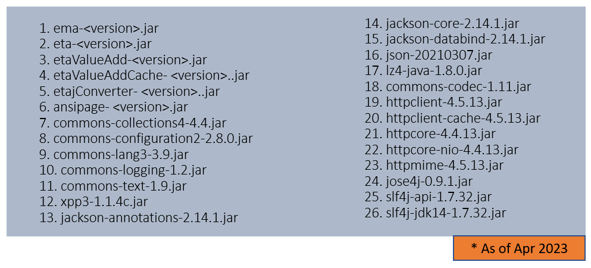
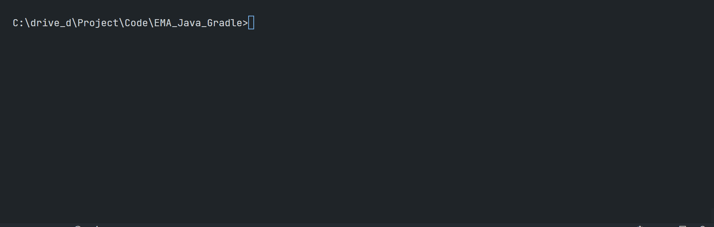

# How to Set Up Enterprise Message API Java Application with Gradle
- version: 1.0
- Last update: Apr 2023
- Environment: Windows, Linux
- Compiler: Java
- Prerequisite: [Demo prerequisite](#prerequisite)

## <a id="Introduction"></a>Introduction

[Refinitiv Real-Time SDK (Java Edition)](https://developers.refinitiv.com/en/api-catalog/refinitiv-real-time-opnsrc/rt-sdk-java) (RTSDK, formerly known as Elektron SDK) is a suite of modern and open source APIs that aim to simplify development through a strong focus on ease of use and standardized access to a broad set of Refinitiv proprietary content and services via the proprietary TCP connection named RSSL and proprietary binary message encoding format named OMM Message. The capabilities range from low latency/high-performance APIs right through to simple streaming Web APIs. 

The SDK has been released on the [Maven Central Repository](https://central.sonatype.com/) to support the modern Java development life cycle since the RTSDK Java (formerly known as Elektron SDK) version 1.2. The Maven Central Repository supported also lets SDK compatibilities with the Java build automation tools like [Gradle](https://gradle.org/) and [Apache Maven](https://maven.apache.org/). This helps Java developers to build RTSDK Java applications, manage its dependencies (Java Developers do not need to manually manage different versions of jar files anymore), and better collaboration in the team.

The RTSDK Java package comes with the Gradle build tool supported by default. However, the included Gradle configuration files are very complex for supporting the SDK multiple APIs (EMA and ETA) and use cases (Core API code, examples, ValueAdd package, etc). If developers want to use Gradle, the RTSDK Java's Gradle settings might not be a good starting point for them.

That is why I am creating this project to show how to use a simple Gradle configuration to work with the EMA Java API. Existing developers who are currently using Gradle also understand how to integrate RTSDK Java into their Gradle project.

Note: 
- This article is based on EMA Java version 3.7.0 L1 (RTSDK Java Edition 2.1.0 L1) and Gradle version 7.3.3 (using Grooy DSL)

## <a id="why_gradle"></a>Why you need build automation tool

So, I will start off with the reason the Java development teams need the build automation tool. The modern Java build automation tools help developers to automate the software build and project management processes including compiling, dependency manager, packing, and running tests. 

If you want to manage the EMA Java application project manually (the old way), you need to manage total **26 jar files** (*as of April 2023*) required by the API as follows:



And developers need to add all jar files to the classpath when running the EMA Java application manually like the following example 

``` bash
$>java -cp .;%EMAJ_HOME%\Libs\ema-<version>.jar;%ETAJ_HOME%\Libs\eta-<version>.jar;%ETAJ_HOME%\Libs\etaValueAdd-<version>.jar;%ETAJ_HOME%\Libs\etaValueAddCache-<version>.jar;%ETAJ_HOME%\Libs\etajConverter-<version>.jar;%ETAJ_HOME%\Libs\ansipage-<version>.jar;%BINPAK%\Ema\Libs\apache\commons-configuration2-2.8.0.jar;%BINPAK%\Ema\Libs\apache\commons-lang3-3.9.jar;%BINPAK%\Ema\Libs\apache\commons-logging-1.2.jar;%BINPAK%\Ema\Libs\apache\commons-text-1.9.jar;%BINPAK%\Ema\Libs\xpp3-1.1.4c.jar;%BINPAK%\Eta\Libs\jackson-annotations-2.14.1.jar;%BINPAK%\Eta\Libs\jackson-core-2.14.1.jar;%BINPAK%\Eta\Libs\jackson-databind-2.14.1.jar;%BINPAK%\Eta\Libs\json-20210307.jar;%BINPAK%\Eta\Libs\lz4-java-1.8.0.jar;%BINPAK%\Eta\Libs\ApacheClient\commons-codec-1.11.jar;%BINPAK%\Eta\Libs\ApacheClient\httpclient-4.5.13.jar;%BINPAK%\Eta\Libs\ApacheClient\httpclient-cache-4.5.13.jar;%BINPAK%\Eta\Libs\ApacheClient\httpcore-4.4.13.jar;%BINPAK%\Eta\Libs\ApacheClient\httpcore-nio-4.4.13.jar;%BINPAK%\Eta\Libs\ApacheClient\httpmime-4.5.13.jar;%BINPAK%\Eta\Libs\jose4j\jose4j-0.9.1.jar;%BINPAK%\Eta\Libs\SLF4J\slf4j-1.7.32\slf4j-api-1.7.32.jar;%BINPAK%\Eta\Libs\SLF4J\slf4j-1.7.32\slf4j-jdk14-1.7.32.jar com.refinitiv.ema.examples.training.consumer.series100.ex100_MP_Streaming.Consumer 
```

The example above is just for running the EMA Java application, the real development project needs to connect to more services,  which means the project needs more jar files, configuration files, etc to manage. This makes the development project hard to set up and hard to collaborate among peers.

The build automation tool can help simplify all of this complexity by helping team manage the project dependencies, and standardize project structure with a simple configuration setting as follows:

``` Grovy
// tag::dependencies[]
dependencies {
    // This dependency is used by the application.
    implementation 'com.refinitiv.ema:ema:3.7.0.0'
}
```
And it lets developers compile, run, and test the application easier command.

``` Bash
$> gradlew run
```
Based on the example above, I think you get the idea of how the build automation tool organizes the project.

## <a id="prerequisite"></a>Prerequisite

Before I am going further, there is some prerequisite, dependencies, and libraries that the project is needed.

### Java SDK

Firstly, you need Java SDK. Please check for the supported Java version from the [API Compatibility Matrix](https://developers.refinitiv.com/en/api-catalog/refinitiv-real-time-opnsrc/rt-sdk-java/documentation#api-compatibility-matrix) page. 

I am using the Open JDK version 11 in this project (as of April 2023).

### Gradle

Next, the [Gradle](https://gradle.org/) build automation tool. Please follow [Gradle installation guide document](https://gradle.org/install/).

### Gradle Wrapper version 7.3.3

Basically, developers use the [Gradle Wrapper](https://docs.gradle.org/7.3.3/userguide/gradle_wrapper.html) to interact with the Gradle build. The Wrapper (```gradlew``` and ```gradlew.bat```) is a script that invokes a declared version of Gradle, downloading it beforehand if necessary. 

This project uses the Gradle Wrapper version 7.3.3 (and above). You can check the current Gradle Wrapper version from the following command:

``` Bash
$> gradlew --version
```

If your Gradle Wrapper is older than version 7.3.3, you can update the Wrapper with the following command:

```  Bash
$> gradlew wrapper --gradle-version=7.3.3
```
### Access to the Refinitiv Real-Time Optimized

This project uses [Customer Identity and Access Management (CIAM) ](https://developers.refinitiv.com/en/article-catalog/article/changes-to-customer-access-and-identity-management--refinitiv-re) (aka Version 2 Authentication) - Client Credentials Grant Model to connect to the Refinitiv Real-Time Optimized (RTO).

Please contact your Refinitiv representative to help you with the RTO account and services.

Note: This is for the *CloudConsumer* example only.

### Access to Refinitiv Real-Time Distribution System

Note: This is for the *LocalConsumer* example only. Please contact your Market Data team to help you with the Refinitiv Real-Time Distribution System (RTDS).

That covers the project's prerequisite

## <a id="devarticle"></a>Development Detail

Please check [How to Set Up Enterprise Message API Java Application with Gradle: Development Detail](./DevDetail.md) document.

## <a id="running"></a>Running the demo applications

My next point is how to run the demo applications. Please see the instructions for each scenario below.

### Running the Cloud Consumer application

Please contact your Refinitiv representative to help you to access the RTO account and services. 

To run the Cloud example, open the project folder in the command prompt and then run the following command:

Version 1 Authentication:
``` bash
gradlew runCloudConsumer --args="-username $RTO_MACHINEID -password $RTO_PASSWORD -clientId $RTO_CLIENTID -itemName $RIC"
```

Version 2 Authentication:
``` bash
gradlew runCloudConsumer --args="-clientId $RTO_CLIENTID_V2 -clientSecret $CLIENTSECRET -itemName $RIC"
```



### Running the Local Consumer application

Please contact your Market data team to help you to access the RTDS account and services. 

To run the Local example, open the project folder in the command prompt and then run the following command: 

``` bash
gradlew run --args="-service $SERVICE_NAME -itemName $RIC"
```

Note: The default service name is *ELEKTRON_DD*.

## <a id="conclusion"></a>Conclusion

Now we come to the conclusion of this EMA Java and Gradle article. The RTSDK Java comes with Gradle supported by default. The library is also available in [Maven central repository](https://search.maven.org/). This makes Java developers can implement the Real-Time application with [Gradle](https://gradle.org/) or other the build automation tools like [Apache Maven](https://maven.apache.org/), or even the dependency manager tool like [Apache Ivy](https://ant.apache.org/ivy/). The tool helps Java developers reduce the complexity of maintaining jar file dependencies, standardized project structure, easily manage the development environment, and support various build processes that match developers' workflow. 

When compared to Maven, the Gradle advantages are highly customizable builds, better performance/faster build time, and support for multi-project builds, and developers may prefer Groovy/Kotlin DSL style configuration over the XML file like Maven. 

In contrast, the Maven is easier to learn when compared with the Gradle, and has larger documents and resources from both official and user-based websites. 

Before I finish, let me just say รt is based on the developers' preferences to choose Gradle or Maven (or others) as a main build tool. If the tool supports the Maven central repository, developers can use the RTSDK Java with their project.

## <a id="ref"></a>References

For further details, please check out the following resources:
* [Refinitiv Real-Time SDK Java page](https://developers.refinitiv.com/en/api-catalog/refinitiv-real-time-opnsrc/rt-sdk-java) on the [Refinitiv Developer Community](https://developers.refinitiv.com/) web site.
* [Refinitiv Real-Time SDK Family](https://developers.refinitiv.com/en/use-cases-catalog/refinitiv-real-time) page.
* [Enterprise Message API Java Quick Start](https://developers.refinitiv.com/en/api-catalog/refinitiv-real-time-opnsrc/rt-sdk-java/quick-start)
* [Developer Webinar: Introduction to Enterprise App Creation With Open-Source Enterprise Message API](https://www.youtube.com/watch?v=2pyhYmgHxlU)
* [Developer Article: 10 important things you need to know before you write an Enterprise Real Time application](https://developers.refinitiv.com/article/10-important-things-you-need-know-you-write-elektron-real-time-application)
* [Changes to Customer Access and Identity Management: Refinitiv Real-Time - Optimized](https://developers.refinitiv.com/en/article-catalog/article/changes-to-customer-access-and-identity-management--refinitiv-re)
* [Gradle Official website](https://gradle.org/)
* [Gradle Getting Started Guide](https://docs.gradle.org/7.3.3/userguide/getting_started.html)
* [Gradle Building Java Applications Sample](https://docs.gradle.org/current/samples/sample_building_java_applications.html)
* [Gradle: Migrating Builds From Apache Maven](https://docs.gradle.org/7.3.3/userguide/migrating_from_maven.html)
* [Gradle vs Maven Comparison](https://gradle.org/maven-vs-gradle/)
* [Logback Official website](https://logback.qos.ch/)
* [A Guide To Logback website](https://www.baeldung.com/logback)
* [Using Gradle and Visual Studio Code with RT-SDK Java examples](https://developers.refinitiv.com/en/article-catalog/article/gradle-with-vs-code-for-refinitiv-realtime-skd-java)


For any question related to this article or the RTSDK page, please use the Developer Community [Q&A Forum](https://community.developers.refinitiv.com/).
